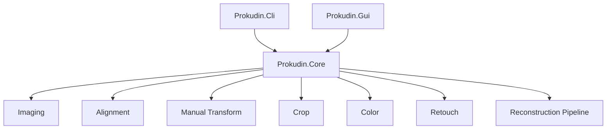
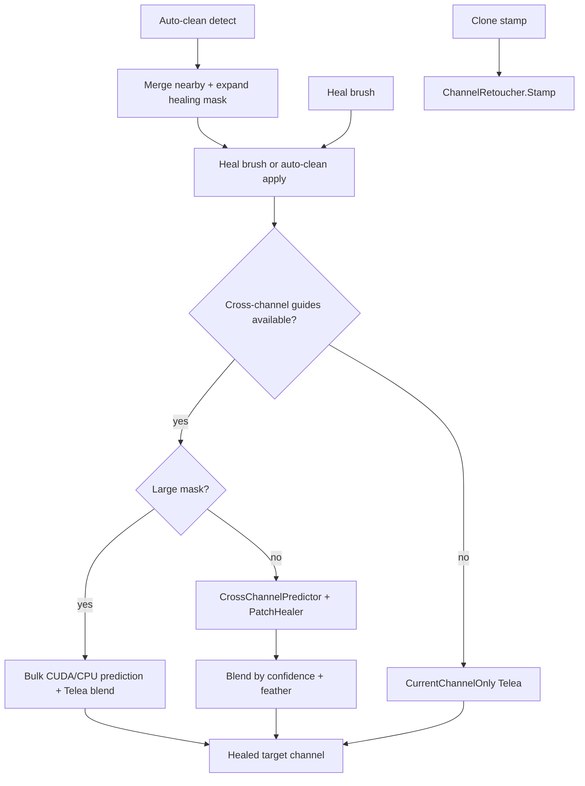

# Architecture

## Overview

The application is split into a reusable Core library and two front ends.



## Project Boundaries

### Prokudin.Core

Core owns all image and reconstruction behavior:

- image load/save with ImageSharp
- grayscale `ImageBuffer`
- RGB `RgbImageBuffer`
- triptych split and segment size normalization
- OpenCvSharp alignment
- manual transform helpers
- overlap and square crop
- color correction
- per-channel retouch, cross-channel guided healing, and auto-clean mask detection
- reconstruction pipeline

Core has no GUI dependency.

### Prokudin.Cli

CLI is a thin argument parser over `ReconstructionPipeline`.

It validates:

- mutually exclusive triptych versus separate channels
- required output path
- supported input extensions
- channel reference values

Exposed alignment tuning includes `--reference`, `--detector`, `--max-align-iter`,
and `--max-translation`.

### Prokudin.Gui

GUI is an Avalonia desktop app using CommunityToolkit.Mvvm.

Main pieces:

- `App.axaml` / `App.axaml.cs`: application bootstrap
- `Views/MainWindow.axaml`: tool UI
- `Views/ChannelSlotCard.axaml`: sidebar channel card with thumbnail
- `Views/ImagePreviewControl.axaml`: zoom, selection, retouch, and mask overlay
- `ViewModels/MainViewModel` (+ workflow partials): commands and workflow state
- `ViewModels/ChannelSlotViewModel.cs`: channel slot state, display and thumbnail bitmaps
- `Editing/`: editor session, undo history, and command objects
- `Services/StorageFileDialogService.cs`: native file pickers
- `Services/JsonExportSettingsStore.cs`: persisted export settings
- `Imaging/AvaloniaBitmapFactory.cs`: Core buffers to Avalonia bitmaps and thumbnails

### Editor command layer

GUI undo/redo is implemented in the editing layer, not in Core:

```text
Editing/
  EditorSession.cs       — memento capture/clone helpers
  EditorMemento.cs       — snapshot of channels, result, align state, color/levels
  EditorHistory.cs       — undo/redo stacks (limit 20)
  IEditorCommand.cs
  Commands/
    SnapshotCommand.cs           — import, align, crop, swap, retouch apply
    CoalescedParameterCommand.cs — exposure, white balance, levels (700 ms merge)
```

`MainViewModel` remains the XAML binding root (`x:DataType="MainViewModel"`). Workflow
RelayCommands live in partial files:

| Partial | Commands |
| --- | --- |
| `MainViewModel.Import.cs` | Open R/G/B, triptych, swap channels |
| `MainViewModel.Align.cs` | Auto-align, rebuild result |
| `MainViewModel.Crop.cs` | Crop overlap, crop to selection |
| `MainViewModel.Clean.cs` | Heal brush, clone stamp, auto-clean |
| `MainViewModel.Color.cs` | Exposure reset, white-balance pipette, levels coalesce |
| `MainViewModel.History.cs` | Undo/redo, memento capture/restore |
| `MainViewModel.Project.cs` | Save/load, autosave, startup |

Export is outside the undo stack. Color edits coalesce within 700 ms into a single undo step.

Design spec: `docs/superpowers/specs/2026-06-27-editor-command-refactor-design.md`.

Auto-clean mask review is split across Core and GUI. Core detects
single-channel defect masks from aligned R/G/B grayscale buffers and applies
healing through `ChannelHealer`. GUI owns the pending-mask review state, mask
overlay bitmap, Ctrl/Alt mask edits, and the explicit apply/cancel commands.

After **Auto-align**, `MainViewModel` stores prepared aligned channels via
`AlignedChannelCropper.CropToLargestFullOverlap` so retouch, crop, and channel
export operate on overlap-cropped working buffers without re-running alignment.

`ChannelSlotViewModel` caches full-resolution `DisplayBitmap` and downscaled
`ThumbnailBitmap` (512 px max side). Both are disposed when replaced.

Retouch strokes and auto-clean apply call `ChannelHealer.HealChannel` on
`Task.Run`. Cross-channel mode passes the two sibling channels as guides.
Auto-clean detection prepares the reviewed mask before apply in the fixed order
raw auto mask -> merge nearby defects -> expand healing area -> final healing
mask; `ChannelHealer` receives that final mask only.

After auto-align, the status bar shows per-channel alignment metadata from
`AlignChannelMetadata.FormatStatus`.

## Typed Image Buffers

`ImageBuffer` supports `PixelFormat.UInt8`, `Float32`, and `UInt16` storage with
normalized `[0, 1]` accessors (`GetNormalized`, `SetNormalized`). `ImageLoader`
preserves 16-bit TIFF samples when detected. OpenCV paths convert through
`ImageMatConverter.ToUInt8MatForInpaint` and `FromMat` to preserve the original
format on output.

## Acceleration

CPU-bound pixel and row loops use `Prokudin.Core.Processing.PixelParallel`,
which keeps small buffers sequential and uses `Parallel.For` for larger managed
arrays. This covers format conversion, color transforms, manual transforms, RGB
merge/resize, retouch mask preparation, and GUI preview byte generation.

Portable compute acceleration is routed through an internal image compute
backend chain. The current chain tries native `Prokudin.Cuda.dll` when present,
then an ILGPU CUDA/OpenCL accelerator when available, and finally the CPU
backend. The accelerated kernels cover auto-clean raw mask classification,
Gaussian high-pass for auto-clean detect prep, large-mask cross-channel
prediction, and normalized exposure gain. Every kernel keeps CPU fallback
behavior, so no reconstruction or GUI workflow requires GPU hardware.

Auto-clean apply (Quality mode) uses a large-mask fast path: bulk
`PredictMasked`, tile-grouped coarse-to-fine `PatchHealer` search, and a
session cache that reuses detect normalization buffers between detect and apply.
The GUI exposes **Quality**, **Balanced**, and **Fast** presets (toolbar
ComboBox); presets affect auto-clean detect/apply only, not heal brush or clone
stamp. **Fast** skips per-component patch search and blends bulk prediction with
Telea on low-confidence pixels.

### Processing diagnostics

`Prokudin.Core.Diagnostics.IProcessingDiagnostics` is an optional sink threaded
through `PipelineSettings`, `HealOptions`, and `AutoCleanSettings`. Default is
`NullProcessingDiagnostics` (zero overhead). The GUI exposes four toggles above
the Processing log:

- **Backends** — native CUDA / ILGPU / CPU fallback attempts per kernel
- **Pipeline** — alignment, reconstruction, and retouch stage summaries
- **CPU parallel** — `PixelParallel` sequential vs parallel decisions and OpenCV thread count
- **Timings** — elapsed milliseconds on accelerated operations

Settings persist in `%LocalAppData%/Prokudin/diagnostics-settings.json`. All toggles
default to off for normal use.

OpenCV calls remain sequential at the call site because they execute in native
code and may use OpenCV's own threading. Alignment search still uses OpenCV
SIFT/ORB, phase correlation, and ECC on CPU. Full-resolution GPU warp and
Avalonia/Skia preview rendering are deferred until benchmarks show those paths
are the dominant bottleneck.

## Retouch and Healing



Core retouch types:

| Type | Role |
| --- | --- |
| `ChannelHealer` | Entry point for masked healing (`HealChannel`) |
| `CrossChannelPredictor` | Local linear prediction from guide channels |
| `PatchHealer` | Patch search and transfer (single-channel and guided) |
| `ChannelRetoucher` | Telea inpaint, auto-clean detection, clone stamp, brush masks |
| `HealingMaskUtils` | Connected components and mask morphology |
| `HealingDebugWriter` | Optional debug PNG output |

`HealOptions` defaults to `HealingMode.CrossChannelGuided` with
`HealingSubMode.Patch` for single-channel fallback. GUI maps toolbar checkboxes
to mode and sub-mode; `Radius` maps to `PatchRadius`. Auto-clean detect/apply
uses `AutoCleanQualityProfiles.Resolve` with the selected quality preset;
settings persist in `%LocalAppData%/Prokudin/auto-clean-settings.json`.

## Reconstruction Pipeline


Steps in code:

1. Load input channels or split triptych.
2. Optionally trim dark borders.
3. Align non-reference channels to the reference channel.
4. Apply manual transforms if supplied.
5. Merge R, G, B into RGB.
6. Crop to overlap, then square crop.
7. Apply white balance and levels.
8. Resize if requested.
9. Apply unsharp mask unless disabled.
10. Save PNG.

## Triptych Handling

`TriptychSplitter` divides a stacked grayscale image along its long axis into
three segments.

- Horizontal image (`width >= height`): three columns.
- Vertical image (`height > width`): three rows.

Segment pixel counts can differ by one when the long side is not divisible by
three. After optional per-segment border trim, all three channels are cropped to
the shared minimum width and height from the top-left origin so alignment never
needs to resize mismatched segment sizes.

Library of Congress Prokudin-Gorskii TIFFs are typically vertical triptychs
with **BGR** order (blue, green, red top to bottom). The GUI defaults to BGR.

## Alignment

`ChannelAligner` uses OpenCvSharp:

- SIFT feature matching by default
- ORB retry when SIFT inlier ratio is low
- homography first
- affine fallback
- median translation fallback
- phase correlation fine alignment on edge maps
- ECC translation refinement
- mask warping for overlap-aware crop

`RunAutoAlign` keeps the reference channel fixed (default: green) and aligns red
and blue. Results include `AlignChannelMetadata` per channel (transform kind,
inlier count, fine shifts).

### MaxTranslation

`AlignOptions.MaxTranslation` limits the per-axis translation component of
accepted coarse transforms and each fine-alignment step.

Coarse SIFT/ORB search runs on a downsampled copy when either channel exceeds
`AlignOptions.CoarseAlignmentMaxSide` (default 1024 px). The transform matrix is
scaled back to full resolution before OpenCV warp, phase correlation, and ECC.

| Setting | Effective limit |
| --- | --- |
| Default `128` | 128 px per axis |
| `0` (auto) | `clamp(min(width, height) × 0.04, 96, 256)` |

Archival LoC scans often need 50–100 px shifts between channels. The previous
default of 48 px caused SIFT to find valid homographies that were then rejected,
leaving channels at identity (no shift).

`ChannelAligner.AlignChannel` calls `AlignOptions.ResolveMaxTranslation` using
the reference channel dimensions.

## Runtime Notes

The current OpenCvSharp native runtime package is `OpenCvSharp4.runtime.win`.
The app builds as cross-platform Avalonia code, but Linux and macOS packaging
need native OpenCV runtime validation before release.
