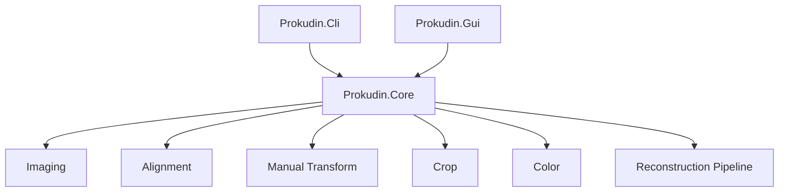

# Architecture

## Overview

The application is split into a reusable Core library and two front ends.

## Project Boundaries

### Prokudin.Core

Core owns all image and reconstruction behavior:

- image load/save with ImageSharp
- grayscale `ImageBuffer`
- RGB `RgbImageBuffer`
- triptych split and segment size normalization
- OpenCvSharp alignment
- manual transform helpers
- overlap and square crop
- color correction
- reconstruction pipeline

Core has no GUI dependency.

### Prokudin.Cli

CLI is a thin argument parser over `ReconstructionPipeline`.

It validates:

- mutually exclusive triptych versus separate channels
- required output path
- supported input extensions
- channel reference values

Exposed alignment tuning includes `--reference`, `--detector`, `--max-align-iter`,
and `--max-translation`.

### Prokudin.Gui

GUI is an Avalonia desktop app using CommunityToolkit.Mvvm.

Main pieces:

- `App.axaml` / `App.axaml.cs`: application bootstrap
- `Views/MainWindow.axaml`: tool UI
- `ViewModels/MainViewModel.cs`: commands and workflow state
- `ViewModels/ChannelSlotViewModel.cs`: channel slot state and cached bitmap
- `Services/StorageFileDialogService.cs`: native file pickers
- `Imaging/AvaloniaBitmapFactory.cs`: Core image buffers to Avalonia bitmaps

After auto-align, the status bar shows per-channel alignment metadata from
`AlignChannelMetadata.FormatStatus`.

## Reconstruction Pipeline

Steps in code:

1. Load input channels or split triptych.
2. Optionally trim dark borders.
3. Align non-reference channels to the reference channel.
4. Apply manual transforms if supplied.
5. Merge R, G, B into RGB.
6. Crop to overlap, then square crop.
7. Apply white balance and levels.
8. Resize if requested.
9. Apply unsharp mask unless disabled.
10. Save PNG.

## Triptych Handling

`TriptychSplitter` divides a stacked grayscale image along its long axis into
three segments.

- Horizontal image (`width >= height`): three columns.
- Vertical image (`height > width`): three rows.

Segment pixel counts can differ by one when the long side is not divisible by
three. After optional per-segment border trim, all three channels are cropped to
the shared minimum width and height from the top-left origin so alignment never
needs to resize mismatched segment sizes.

Library of Congress Prokudin-Gorskii TIFFs are typically vertical triptychs
with **BGR** order (blue, green, red top to bottom). The GUI defaults to BGR.

## Alignment

`ChannelAligner` uses OpenCvSharp:

- SIFT feature matching by default
- ORB retry when SIFT inlier ratio is low
- homography first
- affine fallback
- median translation fallback
- phase correlation fine alignment on edge maps
- ECC translation refinement
- mask warping for overlap-aware crop

`RunAutoAlign` keeps the reference channel fixed (default: green) and aligns red
and blue. Results include `AlignChannelMetadata` per channel (transform kind,
inlier count, fine shifts).

### MaxTranslation

`AlignOptions.MaxTranslation` limits the per-axis translation component of
accepted coarse transforms and each fine-alignment step.

| Setting | Effective limit |
| --- | --- |
| Default `128` | 128 px per axis |
| `0` (auto) | `clamp(min(width, height) × 0.04, 96, 256)` |

Archival LoC scans often need 50–100 px shifts between channels. The previous
default of 48 px caused SIFT to find valid homographies that were then rejected,
leaving channels at identity (no shift).

`ChannelAligner.AlignChannel` calls `AlignOptions.ResolveMaxTranslation` using
the reference channel dimensions.

## Runtime Notes

The current OpenCvSharp native runtime package is `OpenCvSharp4.runtime.win`.
The app builds as cross-platform Avalonia code, but Linux and macOS packaging
need native OpenCV runtime validation before release.
