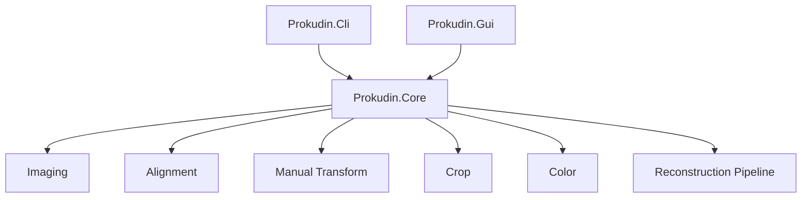

# Architecture

## Overview

The application is split into a reusable Core library and two front ends.

## Project Boundaries

### Prokudin.Core

Core owns all image and reconstruction behavior:

- image load/save with ImageSharp
- grayscale `ImageBuffer`
- RGB `RgbImageBuffer`
- triptych split
- OpenCvSharp alignment
- manual transform helpers
- overlap and square crop
- color correction
- reconstruction pipeline

Core has no GUI dependency.

### Prokudin.Cli

CLI is a thin argument parser over `ReconstructionPipeline`.

It validates:

- mutually exclusive triptych versus separate channels
- required output path
- supported input extensions
- channel reference values

### Prokudin.Gui

GUI is an Avalonia desktop app using CommunityToolkit.Mvvm.

Main pieces:

- `App.axaml` / `App.axaml.cs`: application bootstrap
- `Views/MainWindow.axaml`: tool UI
- `ViewModels/MainViewModel.cs`: commands and workflow state
- `ViewModels/ChannelSlotViewModel.cs`: channel slot state and cached bitmap
- `Services/StorageFileDialogService.cs`: native file pickers
- `Imaging/AvaloniaBitmapFactory.cs`: Core image buffers to Avalonia bitmaps

## Reconstruction Pipeline

1. Load input channels or split triptych.
2. Optionally trim dark borders.
3. Align non-reference channels to the reference channel.
4. Apply manual transforms if supplied.
5. Merge R, G, B into RGB.
6. Crop to overlap, then square crop.
7. Apply white balance and levels.
8. Resize if requested.
9. Apply unsharp mask unless disabled.
10. Save PNG.

## Alignment

`ChannelAligner` uses OpenCvSharp:

- SIFT feature matching by default
- ORB retry when SIFT inlier ratio is low
- homography first
- affine fallback
- median translation fallback
- phase correlation fine alignment on edge maps
- ECC translation refinement
- mask warping for overlap-aware crop

`AlignOptions.MaxTranslation` limits accepted alignment shifts.

## Runtime Notes

The current OpenCvSharp native runtime package is `OpenCvSharp4.runtime.win`.
The app builds as cross-platform Avalonia code, but Linux and macOS packaging
need native OpenCV runtime validation before release.
