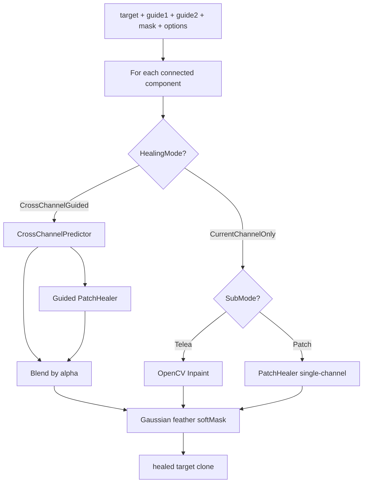

# Cross-Channel Guided Healing — Design

Status: **approved for implementation** (brainstorming session 2026-06-22)

## Understanding Summary

- **Goal:** `CrossChannelGuidedHealing` restores a defective grayscale channel using two aligned guide channels via local linear prediction + guided patch healing, blended by prediction confidence.
- **Why:** Single-channel defects (dust, spots, scratches) become color artifacts after RGB merge; guides carry scene structure the damaged channel lacks under the mask.
- **Users:** Prokudin GUI operators working with aligned R/G/B LoC scans; Core API for automated tests.
- **Constraints:** Modify only target pixels inside mask; guides untouched; no neural generation; no global blur; mandatory async in GUI; quality over speed.
- **Prerequisite:** Stage 0 typed pixel pipeline migration across all of Core before healing work begins.
- **Non-goals:** CLI in v1; persisted healing settings; neural inpaint; automatic repair of large low-confidence regions.

## Assumptions

1. Algorithm defaults from the original spec (radii, weights, `maxComponentArea = 5000`, `alphaMin/Max`, robust LS) are exposed via `HealOptions`.
2. Processing is per connected component of the defect mask.
3. Internal `CrossChannelGuided` fallback → **Patch**; external fallback (guides unavailable) → **Telea**.
4. Conservative mode for components > 5000 px: capped alpha, Patch-heavy — no separate UI warning (status bar only when guides unavailable).
5. Debug output → `debug/heal/{timestamp}/` relative to cwd; directory listed in `.gitignore`.
6. `DetectSingleChannelDefects` unchanged in v1; only Heal Brush and Auto-clean Apply paths change.
7. Patch donor selection v1: **one best donor per connected component** (not per-pixel sliding).

## Decision Log

| # | Decision | Alternatives | Rationale |
|---|----------|--------------|-----------|
| 1 | `CurrentChannelOnly` = Telea + Patch sub-modes | Telea only; Patch only | Preserve legacy Telea; add patch as explicit option |
| 2 | `CrossChannelGuided` in GUI Heal + Auto-clean Apply | Core only; Heal only; + CLI | Primary workflows benefit immediately |
| 3 | Cross-channel **ON by default** | Opt-in; per-tool defaults | Maximum benefit out of the box |
| 4 | Guides unavailable → Telea + status bar indicator | Silent fallback; block; 2-channel model | Operation succeeds; user is informed |
| 5 | Internal CrossChannelGuided fallback → **Patch** | Telea; per-reason; configurable | Aligns with spec patch logic |
| 6 | Cross-channel OFF → GUI Telea/Patch choice, default **Patch** | Telea default | Unified patch-first experience |
| 7 | Quality > speed; async mandatory | Hard SLA limits | Correctness and responsive UI |
| 8 | Debug → `debug/heal/{timestamp}/` | Export dir; temp; configurable | Predictable local comparison |
| 9 | `ImageBuffer` supports uint8 / float / uint16 | Float only; convert on the fly | Matches archival bit depths |
| 10 | Typed model across **entire Core pipeline** | Retouch only; retouch + I/O | End-to-end consistency |
| 11 | **Stage 0 pipeline first**, then healing | Parallel; incremental wrapper | Avoid double work |
| 12 | Healing GUI settings **not persisted** | Save all; save toggle only | Simple predictable defaults |
| 13 | Large component conservative mode — no extra UI warning | Dedicated warning | Status bar sufficient |
| 14 | Architecture: phased typed Core + separate `ChannelHealer` | Monolithic class; strategy interfaces | Maintainable, testable, YAGNI |
| 15 | Donor selection: one best patch per component (v1) | Per-pixel sliding window | Faster; sufficient for small defects |

## Architecture

### Stage 0 — Typed `ImageBuffer`

```
Prokudin.Core.Imaging/
  PixelFormat.cs          // UInt8, Float32, UInt16
  ImageBuffer.cs            // Format + dimensions + typed storage
  ImageBufferFactory.cs
  ImageMatConverter.cs      // ToMat / FromMat per format
```

Migrate modules in order: **Imaging → Alignment → Pipeline → Color → Retouch**. All existing tests must pass after each module.

| Format | Storage | Range |
|--------|---------|-------|
| Float32 | `float[]` | 0..1 |
| UInt8 | `byte[]` | 0..255 |
| UInt16 | `ushort[]` | 0..65535 |

I/O (ImageSharp) preserves source bit depth on load; export unchanged.

### Stage 1+ — Healing module

```
Prokudin.Core.Retouch/
  HealingMode.cs            // CurrentChannelOnly, CrossChannelGuided
  HealingSubMode.cs           // Telea, Patch
  HealOptions.cs
  HealResult.cs
  ChannelHealer.cs            // HealChannel(...) entry point
  CrossChannelPredictor.cs
  PatchHealer.cs
  HealingMaskUtils.cs
  HealingDebugWriter.cs
```

`ChannelRetoucher` remains facade for `InpaintMask`, `DetectSingleChannelDefects`, `Stamp`.

### Data flow



## Algorithm

### A. Local Cross-Channel Prediction

Per connected component:

1. `ring = dilate(component, contextRadius) - component`, minus `globalDefectMask`.
2. If valid ring pixels < `minTrainingPixels`: retry with `contextRadius = 32`; else skip prediction.
3. Robust LS on ring: fit `C ≈ k1*A + k2*B + k3`; drop residuals > p90; refit.
4. Predict inside component; clamp by `PixelFormat`.
5. `predictionConfidence = 1 - clamp(MAE / maxAllowedError, 0, 1)`.

Large component (> `maxComponentArea`): apply `conservativeScale` (e.g. 0.5) to alpha.

Reuse `FitLinearModel` / `Solve3x3` patterns from `ChannelRetoucher`, scoped to ring pixels.

### B. Guided Patch Healing

**Search area:** `dilate(component, searchRadius) - dilate(component, safetyRadius)`, excluding all defect masks. Expand `searchRadius` 48 → 96 if no candidates.

**Score (guided mode):**

```
score = wGuide * guideDiff + wGradient * gradDiff + wBoundary * boundaryDiff + wDistance * distPenalty
```

Defaults: `wGuide=0.45`, `wGradient=0.25`, `wBoundary=0.25`, `wDistance=0.05`.

**Transfer:** target values from donor patch; brightness offset via ring medians; clamp.

**Single-channel Patch mode:** same search without guide terms (boundary + distance only).

### C. Blending

```
alpha = clamp(predictionConfidence, alphaMin, alphaMax) * conservativeScale
C_final = alpha * C_pred + (1 - alpha) * C_patch
softMask = gaussianBlur(componentMask, featherSigma)
C_out = C_orig * (1 - softMask) + C_final * softMask
```

Write only within component bbox + feather halo.

### Fallback matrix

| Condition | Action |
|-----------|--------|
| Guides unavailable (GUI) | `CurrentChannelOnly.Telea` + status bar |
| Ring < minTrainingPixels | Patch single-channel only |
| `confidence < 0.35` | alpha → alphaMin; Patch dominates |
| No donor found | Patch; if still fails → Telea |
| Component > 5000 px | conservative alpha cap |

## API

```csharp
HealResult ChannelHealer.HealChannel(
    ImageBuffer targetChannel,
    ImageBuffer? guideChannel1,
    ImageBuffer? guideChannel2,
    byte[] defectMask,
    HealOptions options);
```

Key `HealOptions` fields:

- `Mode`: `CurrentChannelOnly` | `CrossChannelGuided`
- `SubMode`: `Telea` | `Patch` (for `CurrentChannelOnly`)
- `patchRadius`, `searchRadius`, `safetyRadius`, `contextRadius`, `minTrainingPixels`
- `useLocalLinearPrediction`, `useGuidedPatchSearch`, `useRobustFit`
- `predictionAlphaMin`, `predictionAlphaMax`
- `wGuide`, `wGradient`, `wBoundary`, `wDistance`
- `featherSigma`, `maxAllowedError*` per format
- `maxComponentArea`, `debugOutput`

## GUI integration

| Control | Default | Persist |
|---------|---------|---------|
| Use cross-channel healing | ON | No |
| Healing sub-mode (Telea/Patch) | Patch | No |
| Debug heal output | OFF | No |

Guide resolution by selected channel:

```
R → guides G, B
G → guides R, B
B → guides R, G
```

`ApplyRetouchStroke` and `ApplyAutoCleanMask` call `ChannelHealer.HealChannel` via `Task.Run`.

## Debug output

When `debugOutput = true`, write to `debug/heal/{yyyyMMdd-HHmmss}/`:

- `mask_target.png`
- `component_debug.png`
- `prediction_channel.png`
- `patch_heal_channel.png`
- `final_healed_channel.png`
- `prediction_confidence_map.png`
- `donor_patch_debug.png`

## Testing

### Stage 0

- `ImageBuffer` round-trip per format
- `ToMat` / `FromMat` correctness
- Existing Core tests green after each module migration

### Healing (synthetic)

1. Defect in R only — R healed, G/B unchanged, no red spot in RGB
2. Defect in G only — same for green
3. Saturated red object — R not averaged toward G/B
4. Defect on luminance edge — boundary preserved
5. Defect near image edge — fallback, no exception
6. Guides unavailable — Telea path
7. Pixels outside mask unchanged

Regression: all `ChannelRetoucherTests` pass; `InpaintMask` behavior unchanged.

## Implementation plan

| Stage | Scope | Exit criteria |
|-------|-------|---------------|
| **0** | Typed `ImageBuffer`; migrate Imaging → Alignment → Pipeline → Color → Retouch | All Core tests green; GUI/CLI load/export all formats |
| **1** | `HealingMode`, `HealOptions`, `ChannelHealer` skeleton; `CurrentChannelOnly.Telea` wired | Existing heal paths use new API; Telea identical |
| **2** | `CrossChannelPredictor` | Unit tests for ring LS, robust fit, confidence |
| **3** | Confidence + fallback logic | Fallback matrix tests |
| **4** | `PatchHealer` (single + guided) | Donor search tests |
| **5** | Blend prediction + patch + feather | Tests T1–T5 |
| **6** | `HealingDebugWriter` + GUI controls/async | Manual debug verification |
| **7** | GUI integration + acceptance tests | User-guide update; full test suite green |

## Risks

| Risk | Mitigation |
|------|------------|
| Stage 0 scope creep | Migrate one module at a time; keep float path working until cutover |
| Patch search slow on 3000×3000 | One donor per component; optional search step in options |
| Color flattening on saturated regions | Test T3; confidence + alpha caps |
| Ring contaminated by edge defects | Robust LS p90 rejection; exclude global defect mask |
