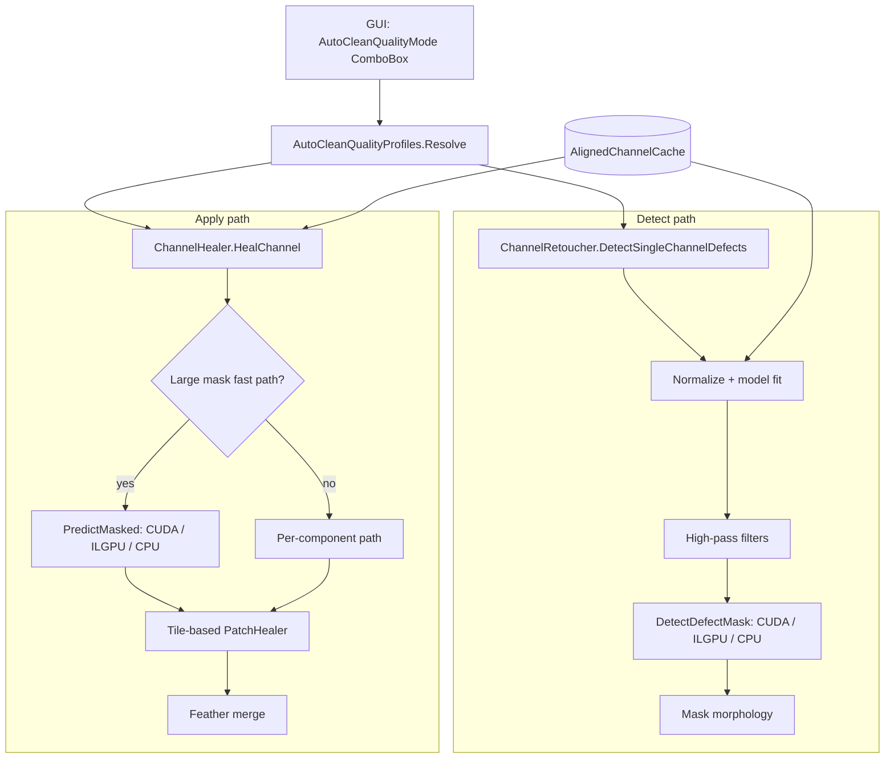

# Auto-Clean Performance Design

Status: approved for implementation planning  
Date: 2026-06-23

## Goal

Reduce auto-clean **detect** and **apply** time on full-resolution archival scans (e.g. 3751×3083, ~155k masked pixels, ~1888 components) while preserving visual quality in the default mode. Expose three user-selectable quality/speed presets in the GUI (Quality / Balanced / Fast) that affect **only** auto-clean detect and apply — not heal brush, clone stamp, or alignment.

**Primary success criterion (Quality mode):** apply time drops from ~7 minutes to under ~60 seconds on the reference LoC TIFF workflow, with no regressions in existing `CrossChannelHealerTests` and auto-clean golden comparisons.

## Problem

Analysis of a real processing log (`master-pnp-prok-01300-01307u.tif`):

| Stage | Time | Acceleration |
| --- | --- | --- |
| `DetectDefectMask` | 50 ms | NativeCuda ✓ |
| `auto-clean.detect` (full scope) | ~32 s | CPU (high-pass, percentiles, morphology) |
| `HealChannel` apply | **~6.5 min** | CPU only |
| `BuildRgb.merge` rebuild | ~5 s | PixelParallel |

Root causes:

1. **Fast path never ran.** Log shows `[retouch] cross-channel large bulk path` but final status is `Cross-channel: parallel patch` — meaning `TryHealLargeMaskFastPath` returned false and the slow per-component path ran. No `[compute] PredictMasked` entry appeared.
2. **Patch search dominates apply.** `PatchHealer.HealComponent` brute-forces donor candidates across the search area for each of ~1888 connected components. Complexity ≈ `O(components × W × H × patch_ops)` on 11.5M pixels.
3. **GPU scope is narrow.** Native CUDA / ILGPU only accelerate `DetectDefectMask`, `PredictMasked`, and `ApplyGain`. Patch search, per-component prediction, feather blending, and detect prep (Gaussian high-pass, percentiles) are CPU-only.
4. **Parallelism overhead.** `Parallel.For` over 1888 small components plus per-component `lock` in `ApplyComponentValues` limits scaling despite MDP=24.

## Chosen Approach

**Hybrid: algorithmic CPU optimization (phase 1) + quality presets (phase 2) + targeted GPU for detect prep (phase 3).**

Deferred: full CUDA kernel for `PatchHealer` donor scoring — high development cost and quality risk; revisit only if phase 1 benchmarks still miss the Quality-mode target.

Rejected as sole solution: presets without core optimization — Quality mode would remain ~7 minutes.

## Architecture



**Principle:** presets map to immutable `(AutoCleanSettings, HealOptions)` bundles in Core. GUI stores the selected mode; Core remains GUI-free. Brush/stamp healing continues to use toolbar `HealOptions` unchanged.

## Quality Presets

### Enum

```csharp
public enum AutoCleanQualityMode
{
    Quality,   // A — default, optimized pipeline, same scoring formulas
    Balanced,  // B — moderate speed/quality trade-offs
    Fast,      // C — preview/batch speed
}
```

### Profile table

| Parameter | Quality (A) | Balanced (B) | Fast (C) |
| --- | --- | --- | --- |
| `AutoMergeDistancePx` | 3 | 5 | 8 |
| `UseGuidedPatchSearch` | true | true | false* |
| `UseLocalLinearPrediction` | true | if global conf < 0.5 | false |
| `SearchRadius` | 48 | 32 | n/a |
| `LowConfidenceThreshold` (fast path) | 0.35† | 0.25 | 0.15 |
| Patch search strategy | tile + coarse-to-fine | tile + step 4 | global predict + Telea |
| Percentile sampling (detect) | exact | exact | 1M-pixel sample |
| Target component count | ~1888 (current) | ~500 | ~100 |

\*Fast: patch only where `globalPrediction[i] < MinWeightedPrediction` (0.01).  
†Quality: fast path may proceed with reduced alpha when `model.Count` is sufficient but confidence is borderline — see §Fast path fix.

### Core API

```csharp
public static class AutoCleanQualityProfiles
{
    public static (AutoCleanSettings Detect, HealOptions Apply) Resolve(
        AutoCleanQualityMode mode,
        AutoCleanSettings userDetect,
        HealOptions userApply);
}
```

`Resolve` starts from GUI-provided user settings (sensitivity, radius, merge/expand toggles) and overlays preset-specific `HealOptions` fields. User sensitivity/radius always apply; preset controls algorithmic strategy only.

### GUI

- `ComboBox` in the auto-clean toolbar (`MainWindow.axaml`), next to Sensitivity and Radius sliders.
- Labels: **Quality**, **Balanced**, **Fast** with tooltips describing trade-offs.
- Persist in `%LocalAppData%/Prokudin/auto-clean-settings.json` via `JsonAutoCleanSettingsStore` (new, mirrors diagnostics settings pattern).
- Default: `Quality`.
- `CreateAutoCleanSettings()` and `CreateHealOptions()` in `MainViewModel` call `AutoCleanQualityProfiles.Resolve`.

**Scope:** preset affects `AutoCleanSelectedChannel` (detect) and `ApplyAutoCleanMask` only.

## Phase 1: Core Optimizations (Quality mode)

### 1.1 Fast path fix

**Current behavior:** `TryHealLargeMaskFastPath` returns false when `CalculateModelConfidence < LowConfidenceThreshold` with no log. Full component path runs even though `PredictMasked` on GPU would take ~50 ms.

**Changes:**

- Log rejection reason at `ProcessingLogCategory.PipelineStage`:
  ```
  [retouch] fast path rejected: confidence=0.28 < 0.35 (training=9_832_000 px)
  ```
- Distinguish hard failures (`model.Count < MinTrainingPixels`) from soft confidence failures.
- **Soft failure policy (Quality only):** when `model.Count >= MinTrainingPixels` but confidence is below threshold, still run `PredictMasked` via compute backend and enter fast path with `baseAlpha` scaled by `confidence / LowConfidenceThreshold` (clamped to `PredictionAlphaMin`). Per-component patch search still runs but skips `UseLocalLinearPrediction` when global prediction is usable.
- Log apply breakdown when diagnostics Pipeline category enabled:
  ```
  [retouch] apply: fast_path=ok, predict=NativeCuda 42ms, patch=1888 components tile-search 18.2s
  ```

### 1.2 Tile-based PatchHealer

Refactor `PatchHealer` without changing `ScoreGuidedDonor` / `ScoreSingleChannelDonor` formulas.

**Precompute (once per apply):**

- Normalized float arrays for target and guides (reuse from fast path when available).
- Per-guide gradient magnitude maps.
- Optional: summed-area tables for patch-mean extraction inside fixed patch radius.

**Tile grouping:**

- Partition image into 256×256 tiles (edge tiles smaller).
- Map each connected component to overlapping tiles.
- Per tile: build union search area for all components in tile; run **one** coarse-to-fine donor search shared as initial candidate filter.

**Coarse-to-fine search (Quality):**

- Scan search area at step 8 px → keep top-8 candidates.
- Refine at step 4 → top-4.
- Refine at step 2 → top-2.
- Final evaluation at step 1 px around survivors (exact current scoring).

Balanced uses step 4 as coarsest level. Fast skips patch search except low-confidence islands.

**Expected speedup:** 20–50× on apply for the reference case (dominated by eliminating 1888 full-frame scans).

### 1.3 Memory and parallelism

- `HealingScratchBuffers`: size pool to `Environment.ProcessorCount`, not component count.
- Avoid `new float[pixelCount]` inside hot loops; use rented buffers.
- `ApplyComponentValues`: accumulate into per-thread row buffers or tile result buffers; single merge pass per tile instead of `lock(sync)` per component.
- `Parallel.For` over **tiles** (typically ~48 tiles for 3751×3083) instead of 1888 micro-tasks.

### 1.4 Aligned channel cache between detect and apply

When detect and apply run on the same aligned channel set in one session:

- Cache normalized `float[]` buffers and linear model from detect in `MainViewModel` (or a small `AutoCleanSessionCache` in Core passed through settings).
- Apply reuses cached arrays instead of re-copying 3× 11.5M floats.
- Cache invalidated on re-align, channel edit, or slot change.

## Phase 2: Quality Presets (Balanced / Fast)

Implement `AutoCleanQualityProfiles` with the table above. Fast mode:

- `PredictMasked` on full mask via GPU.
- `ChannelRetoucher.InpaintMask` (Telea) for regions where prediction confidence is low.
- Skip per-component `PatchHealer` except small low-confidence islands (area < `MaxComponentArea`).

Balanced mode:

- Tile-based patch search with reduced `SearchRadius` (32).
- Larger merge radius to reduce component count.
- Conditional local prediction only when global confidence < 0.5.

## Phase 3: Detect Acceleration

### 3.1 GPU high-pass (optional)

Add `TryHighPassAbs` to `IImageComputeBackend`:

- Input: normalized `float[]`, width, height, sigma.
- Output: `float[]` high-pass absolute values.
- Implement in native CUDA (separable Gaussian), ILGPU, CPU fallback.
- `ChannelRetoucher.DetectSingleChannelDefects` calls backend instead of OpenCV `GaussianBlur` when pixel count exceeds threshold (same pattern as `ApplyGain`).

### 3.2 Persistent GPU buffers (stretch)

If profiling shows H2D/D2H dominates after phase 1:

- `CudaBufferPool` holding device allocations sized to max recent image.
- Reuse across `DetectDefectMask` and `PredictMasked` in one auto-clean session.

Not required for initial implementation.

## Diagnostics Extensions

Extend existing `IProcessingDiagnostics` (no new toggles):

| Event | Category | Example |
| --- | --- | --- |
| Fast path reject/accept | PipelineStage | `[retouch] fast path rejected: …` |
| Apply timing breakdown | PipelineStage | `[retouch] apply: predict=… patch=…` |
| Tile search stats | PipelineStage | `[retouch] patch: 48 tiles, 1888 components` |
| Cache hit | PipelineStage | `[retouch] reuse detect normalization cache` |

## Testing

### Unit tests (Core)

| Test | Purpose |
| --- | --- |
| `AutoCleanQualityProfilesTests` | Each mode produces expected `HealOptions` fields |
| `PatchHealerTileSearchTests` | Tile + coarse-to-fine picks same donor as brute-force on synthetic image |
| `TryHealLargeMaskFastPath_LogsRejectionReason` | Soft/hard failure messages |
| `TryHealLargeMaskFastPath_UsesGpuWhenConfidenceBorderline` | Quality mode runs `PredictMasked` despite low confidence |
| Extend `CrossChannelHealerTests` | No quality regression in Quality mode on existing fixtures |

### Benchmark test (optional, `[Trait("Category", "Benchmark")]`)

- Synthetic 3751×3083 mask with ~1888 components.
- Assert Quality apply < 60 s on CI runner (or local-only if too flaky).

### Manual validation

- Re-run reference LoC TIFF; compare before/after PNG export at 100% zoom on Blue channel defects.
- Verify log shows `PredictMasked` + tile-search timings.
- Toggle Balanced/Fast; confirm faster apply and acceptable preview quality.

## Risks and Mitigations

| Risk | Mitigation |
| --- | --- |
| Tile search picks different donor than brute-force | Final step-1 refinement uses identical scoring; add equivalence tests on small images |
| Fast path soft-failure lowers quality | Quality mode keeps full patch search; only alpha scales down |
| Fast preset visibly worse on archival scans | Default remains Quality; Fast labeled "Preview speed" in UI |
| GPU high-pass numeric drift vs OpenCV | Compare max abs diff on test images; fall back to OpenCV if above epsilon |
| Cache serves stale buffers | Invalidate on align/edit/channel switch; unit test invalidation rules |

## Implementation Phases

| Phase | Deliverable | Target |
| --- | --- | --- |
| **1a** | Fast path fix + rejection logging | `PredictMasked` appears in log |
| **1b** | Tile-based PatchHealer + parallelism fixes | Quality apply < 60 s on reference TIFF |
| **1c** | Detect normalization cache | Detect + apply save ~5–10 s re-copy |
| **2** | `AutoCleanQualityMode` + GUI + persistence | Balanced/Fast selectable |
| **3** | GPU high-pass kernel | Detect ~32 s → ~3–5 s |

## Out of Scope

- CUDA patch-search kernel.
- Performance presets for alignment, heal brush, or clone stamp.
- Changing auto-clean detection algorithm or sensitivity curves.
- Linux/macOS CUDA packaging.

## Files Touched (expected)

| Area | Files |
| --- | --- |
| Core presets | `AutoCleanQualityMode.cs`, `AutoCleanQualityProfiles.cs` |
| Healer | `ChannelHealer.cs`, `PatchHealer.cs`, `HealingScratchBuffers.cs` |
| Detect | `ChannelRetoucher.cs` |
| GPU | `IImageComputeBackend.cs`, `NativeCudaImageComputeBackend.cs`, `IlgpuImageComputeBackend.cs`, `ProkudinCuda.cu` |
| GUI | `MainViewModel.cs`, `MainWindow.axaml`, `JsonAutoCleanSettingsStore.cs` |
| Tests | `AutoCleanQualityProfilesTests.cs`, `PatchHealerTileSearchTests.cs`, extensions to `CrossChannelHealerTests.cs` |
| Docs | `architecture.md`, `development.md` (brief acceleration update) |
