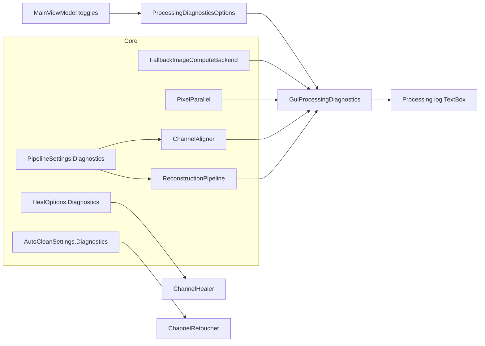

# Processing Diagnostics Design

Status: approved for implementation planning  
Date: 2026-06-23

## Goal

Show in the GUI **Processing log** which compute technology ran at each pipeline stage and for each accelerated operation (CPU, native CUDA, ILGPU CUDA/OpenCL/CPU, and fallback attempts). Three independently switchable diagnostic categories plus optional timings. Detailed output is for design and debugging only; default behavior stays quiet.

## Problem

After the image compute backend chain was added:

- `FallbackImageComputeBackend.Kind` reports the first chain candidate, not the backend that actually executed.
- `DetectDefectMask`, `ApplyGain`, and most healing paths do not log the chosen backend.
- Alignment logs only the compressed `AlignChannelMetadata` summary; coarse search, featureless identity short-circuit, and ORB retry are invisible.
- `PixelParallel` sequential vs parallel decisions are not visible.
- Exposure rebuilds and other hot paths would flood the log without scope-based aggregation.

The only backend hint today is `HealResult.StatusMessage` for large auto-clean prediction.

## Architecture



**Principle:** explicit `IProcessingDiagnostics` passed through options. Default is `NullProcessingDiagnostics` (zero cost). GUI creates a filtering sink; Core has no Avalonia dependency.

## Core API

### Types (`Prokudin.Core.Diagnostics`)

```csharp
[Flags]
public enum ProcessingLogCategory
{
    None = 0,
    ComputeBackend = 1,   // A
    PipelineStage = 2,    // B
    CpuParallel = 4,      // C
    All = ComputeBackend | PipelineStage | CpuParallel,
}

public sealed record ProcessingDiagnosticsOptions(
    ProcessingLogCategory EnabledCategories = ProcessingLogCategory.None,
    bool IncludeTimings = false);

public interface IProcessingDiagnostics
{
    ProcessingDiagnosticsOptions Options { get; }
    IDisposable BeginScope(string operationName, ProcessingLogCategory category);
    void Log(ProcessingLogCategory category, string message);
    void LogComputeAttempt(
        string operation,
        AccelerationBackendKind backend,
        bool succeeded,
        long? elapsedMs = null,
        string? failureReason = null);
}
```

### Implementations

| Type | Role |
| --- | --- |
| `NullProcessingDiagnostics` | Singleton no-op; default everywhere |
| `FilteringProcessingDiagnostics` | Decorator applying category and timing flags |
| `ScopedProcessingDiagnostics` | Scope helper; aggregates parallel stats on dispose |
| `CapturingProcessingDiagnostics` | In-memory capture for tests |
| `GuiProcessingDiagnostics` | GUI project: forwards filtered lines to `AppendLog` |

### Options threading

Add optional `IProcessingDiagnostics? Diagnostics = null` to:

- `PipelineSettings`
- `HealOptions`
- `AutoCleanSettings`

Pass `PipelineSettings.Diagnostics` into `ChannelAligner.AlignChannel` via a new optional parameter. Do not duplicate diagnostics on `AlignOptions`.

### Scope pattern

```csharp
using (diagnostics.BeginScope("BuildRgb.exposure.Red", ProcessingLogCategory.PipelineStage))
{
    ChannelExposure.Apply(image, stops, diagnostics);
}
```

Nested compute logs use category **A**. Category **C** aggregates `PixelParallel` activity inside the scope and emits one summary line on scope dispose.

## Category A — Compute backends

### Primary: `FallbackImageComputeBackend`

For `TryDetectDefectMask`, `TryPredictMasked`, `TryApplyGain`:

1. Log operation name and pixel/buffer size when category A is enabled.
2. For each backend in the chain, call `LogComputeAttempt` with success/failure and optional elapsed ms.
3. Stop on first success.

Example:

```
[compute] DetectDefectMask 4096×3072 (12.6M px): NativeCuda fail → IlgpuCuda ok [4.2ms]
```

### Secondary: direct CPU fallback

When the chain returns `false` and callers use inline CPU (`BuildRawMask`, `FillMaskedPredictionCpu`, `ApplyCpu`):

```
[compute] DetectDefectMask: all backends failed → CPU inline
```

Do not use `FallbackImageComputeBackend.Kind` as the executor label in user-facing diagnostics.

## Category B — Pipeline stages

### `ChannelAligner`

Log when enabled:

- Featureless identity short-circuit (`σ < 1e-6`)
- Coarse search: `CoarseAlignmentMaxSide`, scale, detector
- Match count, transform kind, inliers
- SIFT → ORB retry when `inliers / matches < 0.3`
- Fine alignment shifts

Log inside `AlignChannel` via passed `IProcessingDiagnostics`. Do not bloat public `AlignResult` for diagnostics-only fields.

### `ReconstructionPipeline`

- `RunAutoAlign`: per-channel start/finish
- `BuildRgb`: exposure per channel (skip when |stops| < 0.001), merge, crop mode, color, sharpen, resize

### Retouch

- `ChannelRetoucher.DetectSingleChannelDefects`: prep → mask detect (links to A)
- `ChannelHealer`: healing path (Telea / patch / cross-channel / large bulk), component count, fallback

Keep existing Normal-level `AppendLog` lines in `MainViewModel` unchanged.

## Category C — CPU parallel

### `PixelParallel`

When category C is enabled and an active diagnostics scope exists:

- Record method (`For`, `ForRows`, `Invoke`), iteration/action count, sequential vs `Parallel.For`, `MaxDegreeOfParallelism`
- Do **not** log per iteration
- Emit one summary on scope dispose

### OpenCV

Once per `AlignChannel` when C is enabled: log `Cv2.GetNumThreads()`.

## Noise control

| Event | Behavior |
| --- | --- |
| All diagnostics off | Current log only |
| Debounced exposure rebuild | One `RebuildRgb` scope; A logs `ApplyGain` only when stops ≠ 0 |
| `PixelParallel` outside scope | Silent |
| Fallback attempts | All tries when A enabled |

## GUI

### Controls (above Processing log)

```
☑ Backends   ☑ Pipeline   ☐ CPU parallel   ☐ Timings
```

`MainViewModel` properties:

- `LogComputeBackends`
- `LogPipelineStages`
- `LogCpuParallel`
- `LogTimings`

Map to `ProcessingDiagnosticsOptions` and `GuiProcessingDiagnostics`.

### Log line format

```
[HH:mm:ss] [compute] DetectDefectMask 4096×3072: NativeCuda fail → IlgpuCuda ok [4.2ms]
[HH:mm:ss] [align] Blue: coarse SIFT@1024 scale=0.25 → affine 38 inliers
[HH:mm:ss] [pipeline] BuildRgb: exposure Red +0.5 stops
[HH:mm:ss] [parallel] BuildRgb.merge: Parallel.ForRows 8192 rows, MDP=16
```

Prefix tags: `[compute]`, `[align]`, `[pipeline]`, `[parallel]`, `[retouch]`.

### Persistence

Store in `%LocalAppData%/Prokudin/diagnostics-settings.json`:

```json
{
  "logComputeBackends": false,
  "logPipelineStages": false,
  "logCpuParallel": false,
  "logTimings": false
}
```

Follow `JsonExportSettingsStore` pattern: load on startup, save on toggle change with suppress flag during load. Defaults: all `false`.

## CLI

Deferred. Optional later flag: `--log-diagnostics backends,pipeline,parallel,timings`.

## Testing

| Test | Assert |
| --- | --- |
| `NullProcessingDiagnostics` | Existing tests unchanged |
| Fallback chain capture | Failed NativeCuda + successful CPU logged when A enabled |
| Featureless align | B logs identity, no feature extraction |
| Filtering decorator | C off → no parallel lines |
| Settings round-trip | JSON load/save |
| GUI (optional) | Toggles update `EnabledCategories` |

No test may require NVIDIA GPU or CUDA Toolkit.

## Out of scope

- Structured logging frameworks (Serilog, etc.)
- Log export to file
- GPU profiling beyond `Stopwatch` milliseconds
- CLI diagnostics in v1

## Files

**New (Core):**

- `src/Prokudin.Core/Diagnostics/ProcessingLogCategory.cs`
- `src/Prokudin.Core/Diagnostics/ProcessingDiagnosticsOptions.cs`
- `src/Prokudin.Core/Diagnostics/IProcessingDiagnostics.cs`
- `src/Prokudin.Core/Diagnostics/NullProcessingDiagnostics.cs`
- `src/Prokudin.Core/Diagnostics/FilteringProcessingDiagnostics.cs`
- `src/Prokudin.Core/Diagnostics/ScopedProcessingDiagnostics.cs`
- `src/Prokudin.Core/Diagnostics/CapturingProcessingDiagnostics.cs`
- `src/Prokudin.Core/Diagnostics/ProcessingDiagnostics.cs` (static accessor for active scope / parallel stats)

**New (Gui):**

- `src/Prokudin.Gui/Diagnostics/GuiProcessingDiagnostics.cs`
- `src/Prokudin.Gui/Services/ProcessingDiagnosticsSettings.cs`
- `src/Prokudin.Gui/Services/IProcessingDiagnosticsSettingsStore.cs`
- `src/Prokudin.Gui/Services/JsonProcessingDiagnosticsSettingsStore.cs`

**Modify:**

- `FallbackImageComputeBackend.cs`, `PixelParallel.cs`
- `ChannelAligner.cs`, `ReconstructionPipeline.cs`
- `ChannelExposure.cs`, `ChannelRetoucher.cs`, `ChannelHealer.cs`
- `PipelineSettings.cs`, `HealOptions.cs`, `AutoCleanSettings.cs`
- `MainViewModel.cs`, `MainWindow.axaml`
- `docs/architecture.md`, `docs/development.md` (brief section)
