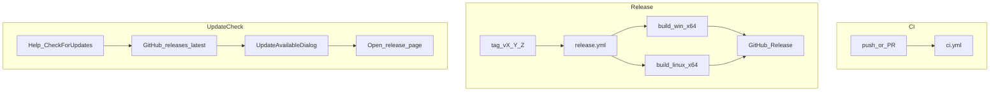

# Distribution Design

Status: approved for implementation  
Date: 2026-06-24

## Goal

Ship prebuilt Prokudin **GUI** and **CLI** binaries for **Windows x64** and **Linux x64** via GitHub Releases, with installer + portable formats on Windows, AppImage + portable tarballs on Linux, CI on every push/PR, and a minimal in-app update check.

macOS distribution (signed DMG) is explicitly deferred to a later phase.

## Decisions

| Topic | Choice |
| --- | --- |
| Update strategy | Help → Check for updates → compare semver → open GitHub Release in browser |
| Release contents | GUI + CLI per platform |
| Phase 1 platforms | `win-x64`, `linux-x64` |
| Phase 2 platforms | `osx-arm64` with codesign/notarization |
| Windows formats | Inno Setup installer + portable single-file zip |
| Linux formats | AppImage + portable tar.gz |
| OpenCV Linux runtime | `OpenCvSharp4.official.runtime.linux-x64.slim` (no GTK highgui) |
| Publish model | Self-contained single-file (`PublishSingleFile`, native self-extract) |

## Architecture



## Artifact naming

```text
Prokudin-{version}-win-x64-setup.exe
Prokudin-{version}-win-x64-portable.zip
Prokudin-Cli-{version}-win-x64.zip
Prokudin-{version}-linux-x64.AppImage
Prokudin-{version}-linux-x64-portable.tar.gz
Prokudin-Cli-{version}-linux-x64.tar.gz
SHA256SUMS.txt
```

Version source: `<Version>` in `Directory.Build.props`, overridden at publish time from the release tag (`v0.9.0` → `0.9.0`).

## Core changes

`Prokudin.Core` selects OpenCvSharp native runtime by RID:

- `win-x64` (or Windows dev build): `OpenCvSharp4.runtime.win`
- `linux-x64` (or Linux dev/CI build): `OpenCvSharp4.official.runtime.linux-x64.slim`

`packaging/Directory.Build.props` applies when `RuntimeIdentifier` is set during `dotnet publish`:

- `SelfContained=true`
- `PublishSingleFile=true`
- `IncludeNativeLibrariesForSelfExtract=true`
- `PublishTrimmed=false`
- `DebugType=none`

Assembly names:

- GUI → `Prokudin`
- CLI → `prokudin`

## CI

`.github/workflows/ci.yml`:

- Triggers: `push` to `main`/`master`, all `pull_request`
- Matrix: `ubuntu-latest`, `windows-latest`
- Steps: restore → build Release → test Release

## Release pipeline

`.github/workflows/release.yml`:

- Triggers: tag `v*`, `workflow_dispatch`
- Jobs `build-win` and `build-linux` publish GUI + CLI, package, upload artifacts
- Job `release` merges artifacts, writes `SHA256SUMS.txt`, publishes GitHub Release

Packaging scripts:

- `packaging/windows/prokudin.iss` + `build-windows.ps1`
- `packaging/linux/build-appimage.sh`, `build-portable.sh`, `prokudin.desktop`
- Icons: `assets/prokudin.png`, `assets/prokudin.ico` (generated via `assets/generate-icon.ps1`)

User settings under `%LocalAppData%/Prokudin/` (Windows) or `~/.local/share` equivalents are **not** touched by the installer.

## GUI update check

| Component | Role |
| --- | --- |
| `DistributionInfo` | GitHub `owner` / `repo` constants |
| `IUpdateChecker` | Abstraction |
| `GitHubReleaseUpdateChecker` | `GET /repos/{owner}/{repo}/releases/latest` |
| `UpdateCheckResult` | Result record |
| `UpdateAvailableDialog` | Shows version + notes; opens `html_url` |
| `MainViewModel.CheckForUpdatesCommand` | Help menu entry |

Errors surface in the status bar; no crash on network failure.

Tests: `GitHubReleaseUpdateCheckerTests` parse JSON fixtures and version comparison (no live HTTP).

## macOS (deferred)

- Add `OpenCvSharp4.runtime.osx.*` by RID
- `macos-latest` release job
- DMG + Apple codesign/notarization secrets
- Document Gatekeeper requirements in README

## Maintainer release process

Documented in [`docs/release.md`](../release.md).

## Risks

| Risk | Mitigation |
| --- | --- |
| Linux slim OpenCV missing symbols | CI runs full `ChannelAlignerTests` on `ubuntu-latest` |
| Large artifact size | Single-file self-contained; no PDB in release |
| AppImage tooling download flakiness | wget in CI; portable tar.gz always produced as fallback |
| GitHub API rate limits | Manual check only; User-Agent header set |

## Out of scope (v1)

- Velopack / NetSparkle auto-update
- macOS release
- Microsoft Store / Flatpak / deb repositories
