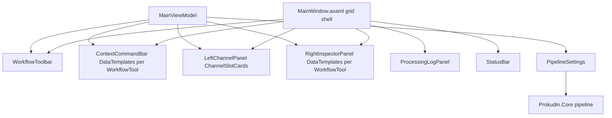

# Prokudin GUI Redesign Design

Status: approved for implementation planning  
Date: 2026-06-24  
Source TZ: `docs/prokudin_ui_redesign_tz.md`

## Goal

Replace the monolithic horizontal toolbar with a professional restoration workspace:

```text
Import → Align → Crop → Clean / Retouch → Color → Export
```

Users freely switch workflow modes (not a wizard). Quick actions live in a context command bar; expert parameters live in a right inspector panel. Layout panels are resizable and persisted.

## Decision: targeted Core extensions (option C)

The original TZ scoped GUI-only changes. The user chose to **add small, targeted Core APIs** so inspector controls for **Levels**, **Gamma**, **align parameters**, and **crop overlap** are real pipeline settings—not disabled placeholders.

Core changes stay minimal: new settings records, wiring in `ReconstructionPipeline.BuildRgb`, and tests. No algorithm rewrites.

## Current state

| Area | Today |
| --- | --- |
| Layout | `DockPanel`: menu, title strip, fixed 260px sidebar + preview column |
| Toolbar | Single `WrapPanel` with align, crop, retouch, color, diagnostics (~40 controls) |
| Export settings | Sidebar popup on Result card |
| Align params | Hardcoded `AlignOptions(TrimBorders: false)` in `MainViewModel.CurrentPipelineSettings()` |
| Levels / gamma | `ColorCorrection.ApplyGentleLevels()` with fixed percentiles inside `BuildRgb` |
| Heal advanced | `HealOptions` in Core has full surface; GUI exposes subset via `CreateHealOptions()` |
| Theme | `FluentTheme`, `RequestedThemeVariant="Default"` only |
| Channel cards | Thumbnail, name, dimensions; no state badge |
| Persistence | Export, diagnostics, auto-clean quality JSON stores |

## Architecture



### ViewModel stack

Keep **CommunityToolkit.Mvvm** (`ObservableObject`, `[RelayCommand]`, `[ObservableProperty]`). Use Zafiro layout primitives (`HeaderedContainer`, `EdgePanel`, `Card`). Do **not** migrate to ReactiveUI.

### File organization (GUI)

| Path | Responsibility |
| --- | --- |
| `ViewModels/WorkflowTool.cs` | Import, Align, Crop, Clean, Color, Export enum |
| `ViewModels/ChannelSlotState.cs` | Empty, Loaded, Aligned, Retouched, Result |
| `ViewModels/AppThemeMode.cs` | Light, Dark, System |
| `Views/MainWindow.axaml` | 6-row grid shell, splitters, panel visibility |
| `Views/WorkflowToolbar.axaml` | Vertical mode buttons |
| `Views/ContextCommandBar.axaml` | `ContentControl` bound to `SelectedWorkflowTool` |
| `Views/ContextBars/*.axaml` | Per-mode quick actions |
| `Views/Inspector/InspectorPanel.axaml` | Header + `ContentControl` for mode content |
| `Views/Inspector/*Inspector.axaml` | Per-mode expert sections |
| `Views/ProcessingLogPanel.axaml` | Collapsible log with diagnostic toggles |
| `Views/StatusBar.axaml` | Left status / center slot / right busy |
| `Views/AboutDialog.axaml` | Modal about box |
| `Views/KeyboardShortcutsDialog.axaml` | Static shortcut reference |
| `Services/UiSettings.cs` | Panel sizes, theme, workflow, visibility |
| `Services/JsonUiSettingsStore.cs` | `%LocalAppData%/Prokudin/ui-settings.json` |
| `Services/ThemeService.cs` | Apply `Application.RequestedThemeVariant` |

`MainViewModel` remains the orchestrator. Inspector/context views bind to `MainViewModel` directly (no nested VM graph in v1).

## Layout specification

### MainWindow grid

**Rows**

| Row | Content | Default height |
| --- | --- | --- |
| 0 | Menu | Auto |
| 1 | Context command bar | Auto |
| 2 | Main workspace | `*` |
| 3 | Horizontal `GridSplitter` | 4px |
| 4 | Processing log | 150px (min 44, max 360) |
| 5 | Status bar | Auto |

**Columns (row 2 workspace)**

| Col | Content | Default width |
| --- | --- | --- |
| 0 | Left channel panel | 260px (min 220, max 420) |
| 1 | Vertical splitter | 4px |
| 2 | Workflow toolbar | 88px (min 72, max 120) |
| 3 | Image preview | `*` |
| 4 | Vertical splitter | 4px |
| 5 | Right inspector | 360px (min 300, max 520) |

Panel widths/heights persist via `JsonUiSettingsStore`. `View → Show *` toggles hide columns/rows without losing splitter values.

### Processing log

- Header: `Processing log | Backends | Pipeline | CPU parallel | Timings | Clear | Collapse`
- Collapse sets row 4 height to header-only (~44px) and `IsProcessingLogVisible = false`
- Preserve auto-scroll-down; disable when user scrolls up (existing `MainWindow.axaml.cs` behavior moves to `ProcessingLogPanel.axaml.cs`)

### Status bar

```text
Left:   Status message (alignment metadata, heal status, etc.)
Center: Selected: {slot} {width}×{height}
Right:  Progress / Ready / Busy indicator
```

Remove duplicate status from the old title `EdgePanel`.

## Workflow toolbar

```csharp
public enum WorkflowTool
{
    Import,
    Align,
    Crop,
    Clean,
    Color,
    Export,
}
```

`MainViewModel.SelectedWorkflowTool` drives context bar and inspector `ContentControl`. All modes always selectable; individual commands use `CanExecute`.

Each button: icon (existing `Icons.axaml`), label, tooltip, `ToggleButton` or styled `Button` with selected class `WorkflowToolButton:selected`.

Selecting **Clean** does not change `EditorToolMode`; tool toggles remain in context bar.

## Context command bars (quick actions only)

| Mode | Controls |
| --- | --- |
| Import | Open R/G/B, Open Triptych, Order BGR/RGB |
| Align | Auto-align, Reference channel, Detector SIFT/ORB, Max shift, Rebuild result |
| Crop | Selection, Crop to selection, Crop overlap, Square crop toggle, Reset crop |
| Clean | Tool Heal/Clone/Auto-mask, Brush, Radius, Detect, Apply, Cancel |
| Color | Auto WB, WB picker, Reset exposure |
| Export | Export result, Export channels, Format combo, Settings toggle |

Rename label **Agg → Sensitivity** everywhere (XAML only; property stays `AutoCleanSensitivity`).

## Right inspector (expert parameters)

### Common header (all modes)

```text
Selected
Channel: {slot}
Size: {dimensions}
State: {ChannelSlotState badge}
Zoom: Fit / 1:1
```

### Import

- Triptych order, input mode (read-only derived: separate vs triptych)
- Trim dark borders (`AlignOptions.TrimBorders`)
- Source bit depth (readonly from `ImageBuffer.PixelFormat`)

### Align

- Reference channel, detector, max translation, max fine iterations, coarse alignment max side
- Readonly per-channel metadata from `lastAligned.AlignMetadata` (transform kind, inliers, shifts)

### Crop

- Selection X/Y/Width/Height (two-way with `SelectionRect`)
- Lock square selection
- Crop selected channel only / crop all aligned / crop result + prepared R/G/B (behavior flags for `CropToSelection` and overlap crop)
- Reset crop clears selection (`SelectionRect = Empty`)

### Clean

Sections per TZ §11: Retouch Tool, Healing Model, Mask Preparation, Patch Search, Prediction Blend, Debug. Wire all `HealOptions` fields currently omitted from `CreateHealOptions()`.

Persist extended heal settings in `AutoCleanSettingsSnapshot` (expand JSON store).

### Color

- Auto WB, WB picker mode, R/G/B exposure, reset
- **Levels black point**, **levels white point**, **gamma** (new Core settings; see below)

### Export

- Format, max side, PNG/JPEG/TIFF options
- Export result / export channels
- Open output folder after export (new GUI flag; `Process.Start` explorer on success)

## Channel cards

Add `ChannelSlotState` on `ChannelSlotViewModel`:

| State | Condition |
| --- | --- |
| Empty | No image/result |
| Loaded | Raw channel image, not in prepared set |
| Aligned | Channel matches `lastAligned` prepared working image |
| Retouched | Channel image differs from aligned snapshot (heal/crop on channel) |
| Result | Result slot with RGB |

Visual: small badge `Border` with shared style `ChannelStateBadge`. Selected card: `SlotCard:selected` border accent (existing pattern in `Containers.axaml`).

Keep drag/drop swap R↔G↔B; Result excluded.

## Core extensions

### 1. Levels and gamma

New record `Prokudin.Core.Color.LevelsSettings`:

```csharp
public sealed record LevelsSettings(
    LevelsMode Mode = LevelsMode.AutoPercentile,
    float BlackPoint = 0.0f,      // normalized input black, used when Mode = Manual
    float WhitePoint = 1.0f,      // normalized input white
    float Gamma = 1.0f,
    float AutoLowPercent = 1.0f,  // reproduces current gentle levels when Mode = AutoPercentile
    float AutoHighPercent = 99.0f,
    float AutoMaxGain = 1.3f);

public enum LevelsMode
{
    Off,
    AutoPercentile,  // default — current behavior
    Manual,
}
```

New methods on `ColorCorrection`:

- `ApplyLevelsSettings(RgbImageBuffer rgb, LevelsSettings settings)` — dispatches by mode
- `ApplyManualLevelsAndGamma(RgbImageBuffer rgb, float black, float white, float gamma)` — stretch then gamma curve

`PipelineSettings` gains `LevelsSettings Levels { get; init; } = new();`

`ReconstructionPipeline.BuildRgb` replaces:

```csharp
corrected = ColorCorrection.ApplyGentleLevels(corrected);
```

with:

```csharp
corrected = ColorCorrection.ApplyLevelsSettings(corrected, settings.Levels);
```

**Default** `LevelsSettings()` preserves existing output (AutoPercentile 1/99/1.3).

### 2. Align options (GUI wiring only)

`AlignOptions` already exposes Reference, Detector, MaxFineIterations, TrimBorders, MaxTranslation, CoarseAlignmentMaxSide. `MainViewModel` adds observable properties and passes them through `CurrentPipelineSettings()`.

### 3. Crop overlap command

`AlignedChannelCropper.CropToLargestFullOverlap` already exists. New GUI command `CropOverlapCommand`:

- Requires `lastAligned` and prepared channels
- Crops all three channels + masks to largest full overlap rectangle
- Rebuilds result via `BuildRgb`
- Pushes undo

**Square crop**: GUI-only `LockSquareSelection` bool; `ImageSelectionRect.FromPoints` gains optional `forceSquare` parameter constraining to `max(|dx|, |dy|)`.

**Reset crop**: clears `SelectionRect` (no Core change).

### 4. HealOptions surface

No Core type changes. Expand `CreateHealOptions()` and `AutoCleanSettingsSnapshot` to include:

- `UseLocalLinearPrediction`, `UseGuidedPatchSearch`, `UseRobustFit`
- `PatchRadius`, `SearchRadius`, `SafetyRadius`, `ContextRadius`, `MinTrainingPixels`
- `PredictionAlphaMin/Max`, `FeatherSigma`, `MaxAllowedError*`, `LargeComponentConservativeScale`

Quality profile resolution via `AutoCleanQualityProfiles.Resolve` unchanged.

## Theme system

```csharp
public enum AppThemeMode { Light, Dark, System }
```

`ThemeService.Apply(AppThemeMode)`:

- Light → `ThemeVariant.Light`
- Dark → `ThemeVariant.Dark`
- System → `ThemeVariant.Default` (follow OS)

Menu: `View → Theme → Light / Dark / System`. Optional compact toggle in context bar end (nice-to-have in Stage 5).

Persist in `UiSettings.ThemeMode`.

## UI settings persistence

```csharp
public sealed class UiSettings
{
    public AppThemeMode ThemeMode { get; set; } = AppThemeMode.System;
    public double LeftPanelWidth { get; set; } = 260;
    public double RightInspectorWidth { get; set; } = 360;
    public double ProcessingLogHeight { get; set; } = 150;
    public bool IsProcessingLogVisible { get; set; } = true;
    public bool IsLeftChannelPanelVisible { get; set; } = true;
    public bool IsRightInspectorVisible { get; set; } = true;
    public WorkflowTool SelectedWorkflowTool { get; set; } = WorkflowTool.Import;
}
```

Path: `%LocalAppData%/Prokudin/ui-settings.json`

Load on `MainViewModel` construction; save on change (debounced 300ms like export settings).

## Menu and dialogs

Extend menu per TZ §16. Wire existing commands; add:

- `RebuildResultCommand` (extract from existing rebuild path)
- `View` submenu with theme + panel visibility + zoom
- `Tools` submenu mirroring editor tool modes
- `Help → About Prokudin` → `AboutDialog`
- `Help → Keyboard Shortcuts` → static dialog (Ctrl+Z/Y, tool keys)
- `File → Exit`

About dialog content: product name, one-line description, assembly version, ".NET / Avalonia desktop application."

## Implementation stages

Matches TZ §21:

1. **Layout refactor** — grid shell, splitters, move existing controls into placeholder regions
2. **Workflow state** — `WorkflowTool`, vertical toolbar, context bars
3. **Right inspector** — dynamic panels, relocate expert settings, Core levels + align wiring
4. **Menu, About, Help** — dialogs and menu completion
5. **Theme + UiSettings** — persistence, theme switching
6. **Polish** — disabled states, 1280×800 / 1920×1080 pass, rename Agg→Sensitivity, acceptance checklist

## Testing strategy

### Core (new/changed)

- `LevelsSettings` manual mode: black/white stretch + gamma changes pixel range
- Default `LevelsSettings` matches prior `ApplyGentleLevels` output on fixture image (regression)
- `ImageSelectionRect` square constraint geometry

### GUI

- `JsonUiSettingsStoreTests` round-trip
- `MainViewModelTests` extensions: `SelectedWorkflowTool` change does not clear images; align options flow to `CurrentPipelineSettings()`
- Existing GUI tests must pass unchanged behavior for align, crop, export, undo

Manual acceptance: TZ §22 checklist (20 items).

## Non-goals

- Neural enhancement, batch workflows, cloud processing
- ReactiveUI migration
- Rewriting `ImagePreviewControl`
- Linux/macOS packaging validation

## Risks and mitigations

| Risk | Mitigation |
| --- | --- |
| `MainViewModel` grows further | Extract inspector bindable groups into partial class files only if needed; views stay dumb |
| Splitter persistence fights min widths | Clamp on save/load to TZ min/max table |
| Levels manual mode breaks archival look | Default remains AutoPercentile; manual is opt-in |
| Missing heal param breaks quality profiles | Pass user base `HealOptions` into `AutoCleanQualityProfiles.Resolve` as today |
