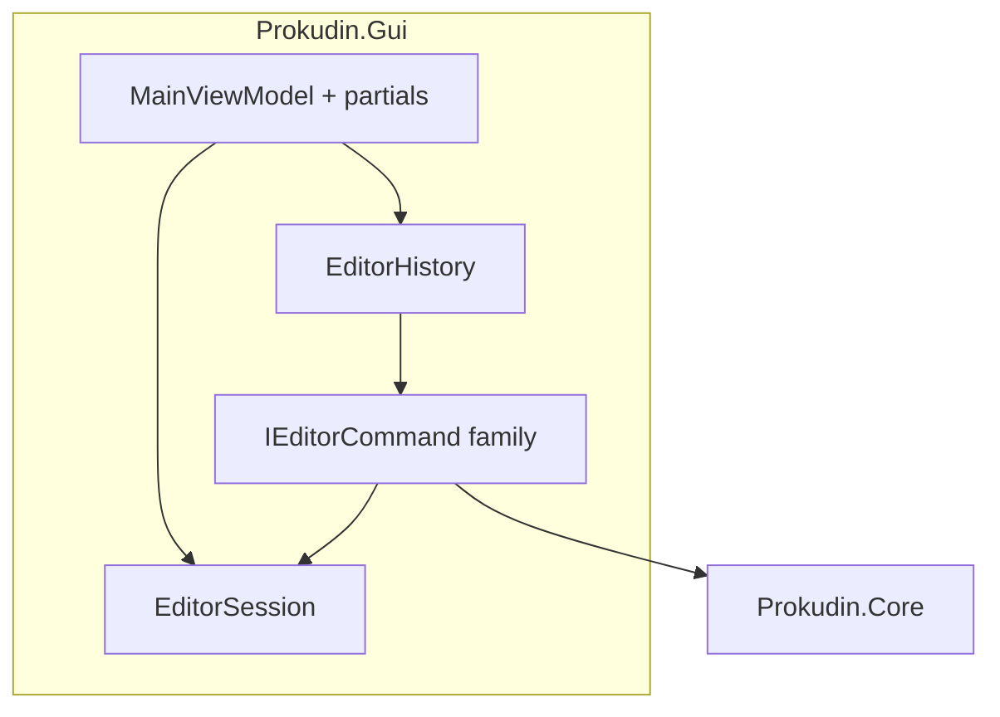

# Editor Command Refactor & Dead Code Cleanup — Design Spec

**Date:** 2026-06-27  
**Status:** Approved  
**Format version:** 1

## Understanding Summary

- **Goal:** Three-phase refactor of Prokudin GUI — **A** dead-code cleanup, **B** editor architecture simplification, **C** release stabilization.
- **Why:** `MainViewModel` (~3700 lines) is a god object; undo via memento is scattered; levels are missing from undo snapshots; hard to maintain and test.
- **Users:** Expert restorers in the desktop GUI. **Core** and **CLI** stay unchanged except explicit dead-code removal in Core.
- **Approach:** Command pattern in the GUI layer; hybrid snapshot + lightweight commands; `EditorSession` + `EditorHistory`; partial files by workflow; XAML binding remains on `MainViewModel`.
- **Undo granularity (option 4):** color — coalesced; align/crop/import — one user operation; heal/stamp/auto-clean apply — each stroke; limit 20.
- **Non-goals:** Workflow ViewModels and XAML binding changes; neural enhancement; batch workflows; undo for export; Core pipeline refactor.

## Assumptions

| # | Assumption |
|---|------------|
| A1 | `TreatWarningsAsErrors` stays `false` in CI; strict audit runs locally in phase A |
| A2 | 20 undo steps with full snapshot clones are acceptable on typical LoC scans |
| A3 | Color coalesce debounce = **700 ms** (same as current exposure) |
| A4 | `IsBusy` blocks undo/redo and new commands |
| A5 | Project save/autosave does not persist undo stack |
| A6 | GPU/ILGPU fallback chain remains; audit does not remove acceleration paths |
| A7 | New tests live in `Prokudin.Gui.Tests` |

## Architecture



### Target file layout

```text
src/Prokudin.Gui/
  Editing/
    EditorSession.cs
    EditorHistory.cs
    EditorMemento.cs
    IEditorCommand.cs
    IAsyncEditorCommand.cs
    Commands/
      CoalescedParameterCommand.cs
      SnapshotCommand.cs
      ChannelPixelCommand.cs
  ViewModels/
    MainViewModel.cs
    MainViewModel.History.cs
    MainViewModel.Import.cs
    MainViewModel.Align.cs
    MainViewModel.Crop.cs
    MainViewModel.Clean.cs
    MainViewModel.Color.cs
    MainViewModel.Project.cs
```

### Command taxonomy

| Family | Used for | Undo storage | Merge |
|--------|----------|--------------|-------|
| `CoalescedParameterCommand` | Exposure, WB, levels | Parameter diff only | Yes, 700 ms, same key |
| `SnapshotCommand` | Import, align, crop overlap, crop selection, swap | Full `EditorMemento` before execute | No |
| `ChannelPixelCommand` | Heal brush, clone stamp, auto-clean apply | Channel snapshot (delta later) | No |

**Outside undo stack:** export, mask review, workflow switch, preview zoom.

### `EditorMemento` fields

Channels (R/G/B + paths), result RGB, `lastAligned`, exposure stops, white balance pipette, **levels** (mode, black/white/gamma), selected slot display name.

Ephemeral state (pending auto-clean mask, session cache) cleared on undo via `PostUndoHook` in ViewModel.

## Implementation Phases

| Phase | Deliverable |
|-------|-------------|
| **A** | Dead-code report; remove confirmed orphans; baseline undo tests; TZ deprecation banner |
| **B.1** | `EditorSession` + `EditorMemento` (with levels) |
| **B.2** | `EditorHistory`; snapshot commands |
| **B.3** | `CoalescedParameterCommand`; fix levels undo |
| **B.4** | Partial split `MainViewModel` |
| **C** | GUI smoke; `docs/architecture.md` + `AGENTS.md`; CI green |

## Phase A — Dead Code Audit

### Method

1. Build with latest analyzers locally; review IDE0051 / unused members in `src/`.
2. Reference search (`rg`) for public types with zero usages outside definition.
3. CLI vs GUI parity — Core symbols unused by CLI, GUI, and tests are candidates (not GPU paths).
4. Document stale specs; do not delete historical design docs without review.

### Confirmed removals (phase A)

| Symbol | Reason |
|--------|--------|
| `AccelerationBackendKind.CudaAvailable` | Unused alias for `NativeCuda` |

### Known gaps to fix in B

| Gap | Fix phase |
|-----|-----------|
| Levels not in `EditorSnapshot` | B.3 |
| `MainViewModelTests` missing from repo | A (restore baseline) |

## Risks & Mitigations

| Risk | Mitigation |
|------|------------|
| Undo memory (20 × full clones) | Parameter commands without clones; delta retouch later |
| Async commands | `IAsyncEditorCommand`; snapshot **before** await |
| Coalesce + Undo race | Cancel debounce timer on undo |
| `MarkProjectDirty` on undo push | `EditorHistory.OnStateMutated` callback |
| Partial files without boundaries | Logic in `Commands/`; partials only host RelayCommands |

## Decision Log

| # | Decision | Alternatives | Why |
|---|----------|--------------|-----|
| D1 | Priority A → B → C | B only; all at once | Noise first, then structure, then release |
| D2 | Command in GUI, not Core | Command in Core | Core stays pure |
| D3 | Hybrid snapshot + parameter commands | Memento only; inverse only | Balance memory and API |
| D4 | Undo granularity option 4 | 1 / 2 / 3 | Matches expert workflow |
| D5 | `EditorSession` separate | State in ViewModel | Testable boundaries |
| D6 | Binding on `MainViewModel` | Workflow ViewModels | 15+ AXAML files unchanged |
| D7 | Partial by workflow | Immediate ViewModel split | Low risk |
| D8 | Export outside undo | Undo export | No user value |
| D9 | `IAsyncEditorCommand` | Sync wrappers | Snapshot before await |
| D10 | Levels in memento + coalesce | Snapshot only | Closes undo bug |
| D11 | `CudaAvailable` removed | Keep alias | Zero references |
| D12 | No CI `warnaserror` for IDE0051 (v1) | Enable in CI | Avoid blocking on style churn |

## Open Questions (defaults accepted)

| # | Question | Default |
|---|----------|---------|
| Q1 | CI `warnaserror` for IDE0051? | No on first pass |
| Q2 | Delta retouch undo? | After B.4 |
| Q3 | Deprecate `prokudin_ui_redesign_tz.md`? | Yes — banner added |
| Q4 | SemVer | PATCH for A; MINOR if B changes observable undo (levels fix) |
