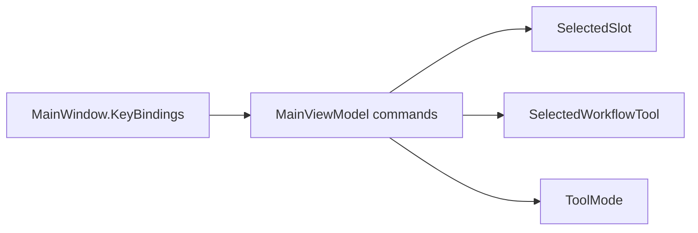

# Keyboard Shortcuts — Design Spec

**Date:** 2026-06-29  
**Status:** Approved  
**Format version:** 1

## Understanding Summary

- **Goal:** Add editor keyboard shortcuts for channel/result preview switching and retouch/selection tool activation in the Prokudin GUI.
- **Why:** Reduce mouse travel during restoration — switch R/G/B/Result and Heal/Clone/Selection without clicking the sidebar or workflow toolbar.
- **Users:** Desktop GUI restorers working through Import → Align → Clean → Color → Export workflows.
- **Scope (v1):** Seven shortcuts — slot keys `1`–`4` (top row + numpad), tool keys `H` / `C` / `M` — plus help dialog and user-guide updates.
- **Non-goals:** Brush size `[` / `]`, white balance picker shortcut, workflow switching by number, user-configurable key maps, macOS-specific validation.

## Shortcut Table

| Key | Action | Workflow change | Blocked when |
|-----|--------|-----------------|--------------|
| `D1`, `NumPad1` | Select **Red** slot | None | Text/numeric input focus only |
| `D2`, `NumPad2` | Select **Green** slot | None | Text/numeric input focus only |
| `D3`, `NumPad3` | Select **Blue** slot | None | Text/numeric input focus only |
| `D4`, `NumPad4` | Select **Result** slot | None | Text/numeric input focus only |
| `H` | **Heal** brush | → **Clean** (if not already) | `IsBusy`, `IsAutoCleanMaskPending`, text focus |
| `C` | **Clone** stamp | → **Clean** (if not already) | `IsBusy`, `IsAutoCleanMaskPending`, text focus |
| `M` | **Selection** tool | → **Crop** (unless already **Clean**) | `IsBusy`, `IsAutoCleanMaskPending`, text focus |

### Slot switching

- Always sets `SelectedSlot` to the mapped slot (`Slots[0..3]` = Red, Green, Blue, Result), **even when the slot is empty**.
- Does **not** change `SelectedWorkflowTool`.
- Existing `OnSelectedSlotChanged` side effects apply (clear auto-clean mask, reset white-balance picker when leaving Result, etc.).

### Tool activation

| Current workflow | `H` | `C` | `M` |
|------------------|-----|-----|-----|
| **Clean** | `ToolMode = Heal` | `ToolMode = Clone` | `ToolMode = Select` (stay in Clean) |
| Any other | `SelectedWorkflowTool = Clean` + Heal | `SelectedWorkflowTool = Clean` + Clone | `SelectedWorkflowTool = Crop` + Select |

- Reuses existing `SelectTool(EditorToolMode)` guards (`WhiteBalancePicker` availability not relevant for H/C/M).
- Heal/Clone on Result slot: shortcut fires but retouch remains unavailable in preview (unchanged product rule).

### Blocking rules

| State | `1`–`4` | `H` / `C` / `M` |
|-------|---------|-----------------|
| `IsBusy` | Allowed | Blocked |
| `IsAutoCleanMaskPending` | Allowed | Blocked |
| Focus in `TextBox`, `TextArea`, `NumericUpDown` | Blocked | Blocked |

Existing project shortcuts (`Ctrl+Z/Y`, `Ctrl+N/O/S`, `Ctrl+Shift+S`) are unchanged.

## Assumptions

| # | Assumption |
|---|------------|
| A1 | Shortcuts are active when the main window has focus, except text/numeric inputs in the inspector, settings, or dialogs |
| A2 | Top-row digits and numpad `1`–`4` are equivalent bindings (14 `KeyBinding` entries) |
| A3 | Shortcut handling is O(1); no measurable UI lag |
| A4 | Windows and Linux are in scope; macOS deferred with the rest of GUI distribution |
| A5 | No persistence of shortcut preferences in `ui-settings.json` |
| A6 | Undo/redo blocking during `IsBusy` remains unchanged; slot keys stay usable during busy operations |

## Architecture

**Recommended approach:** `KeyBinding` in `MainWindow.axaml` → new `RelayCommand` methods on `MainViewModel` (same pattern as `Ctrl+Z`).



### Target files

```text
src/Prokudin.Gui/
  ViewModels/
    MainViewModel.KeyboardShortcuts.cs   # new partial
  Views/
    MainWindow.axaml                     # KeyBindings + Tools menu InputGesture
    KeyboardShortcutsDialog.axaml        # updated table
docs/
  user-guide.md                          # shortcut section
tests/Prokudin.Gui.Tests/
  KeyboardShortcutTests.cs               # or extend MainViewModelTests
```

### Commands (ViewModel)

```csharp
// Illustrative API — names may vary at implementation
SelectSlotCommand(int index)           // 0=Red … 3=Result; CanExecute: !IsTextInputFocused
ActivateHealToolCommand()            // CanExecute: CanActivateEditorToolShortcut
ActivateCloneToolCommand()
ActivateSelectionToolCommand()
```

`CanActivateEditorToolShortcut` => `!IsBusy && !IsAutoCleanMaskPending && !IsTextInputFocused`.

Notify `CanExecute` on `IsBusy`, `IsAutoCleanMaskPending`, and focus changes (subscribe to window focus manager or re-check in `Execute` with early return + `NotifyCanExecuteChanged` from busy/mask property changes).

### Focus guard

Inspect `FocusManager.GetFocusedElement()`; treat as text input when the focused control is (or is inside) `TextBox`, `TextArea`, or `NumericUpDown`. Apply to **all seven** shortcuts.

### Alternatives considered

| Approach | Verdict |
|----------|---------|
| Single `KeyDown` handler in `MainWindow.axaml.cs` | Rejected — diverges from existing `KeyBinding` pattern |
| Dedicated `KeyboardShortcutService` | Rejected — YAGNI for seven keys |
| **KeyBinding → ViewModel commands** | **Chosen** — consistent, testable |

## Testing Strategy

Unit tests in `Prokudin.Gui.Tests` (no headless keyboard simulation):

1. `SelectSlot(1)` → `SelectedSlot == GreenSlot` (empty slot allowed).
2. From Import + `ActivateHealTool` → `SelectedWorkflowTool == Clean`, `ToolMode == Heal`.
3. Already Clean + `ActivateSelectionTool` → workflow stays Clean, `ToolMode == Select`.
4. From Align + `ActivateSelectionTool` → `SelectedWorkflowTool == Crop`, `ToolMode == Select`.
5. `IsBusy == true` → tool commands cannot execute; slot commands can.
6. `IsAutoCleanMaskPending == true` → tool commands cannot execute.

Manual smoke: press `1`–`4` across workflows; `H`/`C`/`M` from Import and Clean; verify inspector numeric fields do not trigger shortcuts while editing.

## Documentation Updates

- `KeyboardShortcutsDialog.axaml` — full shortcut table with workflow notes.
- `docs/user-guide.md` — extend **Keyboard shortcuts** section.
- `CHANGELOG.md` + version bump on implementation (feature → MINOR while `0.x.y`).

## Decision Log

| # | Decision | Alternatives | Rationale |
|---|----------|--------------|-----------|
| D1 | Contextual tools, global slots | All global; all contextual | Matches restoration flow |
| D2 | `H` / `C` / `M` key map | Photoshop V/J/S; numeric 5/6 | User preference; mnemonic letters |
| D3 | H/C switch to Clean; M → Crop except in Clean | Tools only change within current workflow | Faster entry into retouch/crop |
| D4 | Empty slots still selectable via `1`–`4` | Skip empty; cycle loaded only | Predictable index mapping |
| D5 | Block H/C/M on `IsBusy` and mask pending; slots always on | Block all; block nothing | Aligns with undo busy gate for tools |
| D6 | Numpad included in v1 | Top row only | User request |
| D7 | `KeyBinding` + ViewModel partial | Code-behind router; shortcut service | Minimal diff, testable |
| D8 | v1 scope = seven keys only | Brush size, WB picker | YAGNI |

## Implementation Checklist

- [ ] Add `MainViewModel.KeyboardShortcuts.cs` with commands and focus guard
- [ ] Wire 14 `KeyBinding` entries + Tools menu `InputGesture`
- [ ] `NotifyCanExecuteChanged` for tool commands on busy/mask transitions
- [ ] Unit tests (6 cases above)
- [ ] Update `KeyboardShortcutsDialog`, `user-guide.md`
- [ ] Manual smoke on Windows
